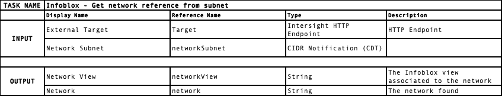
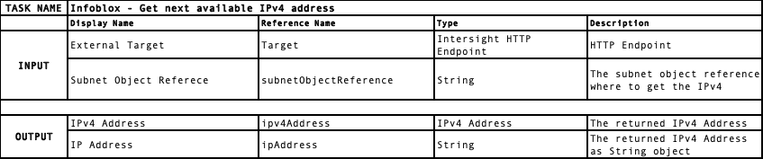
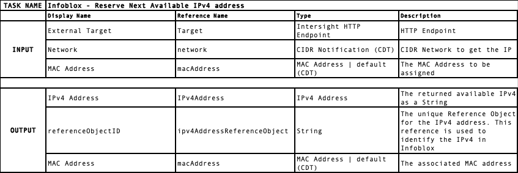
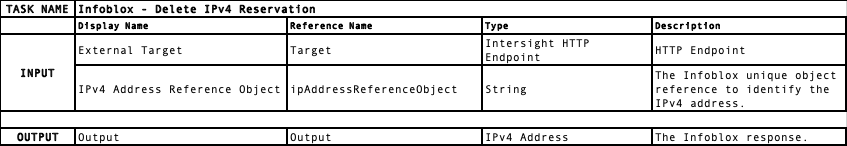
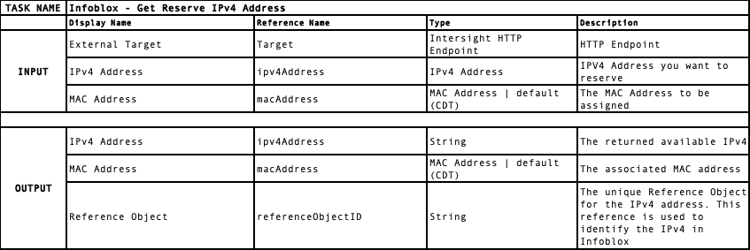
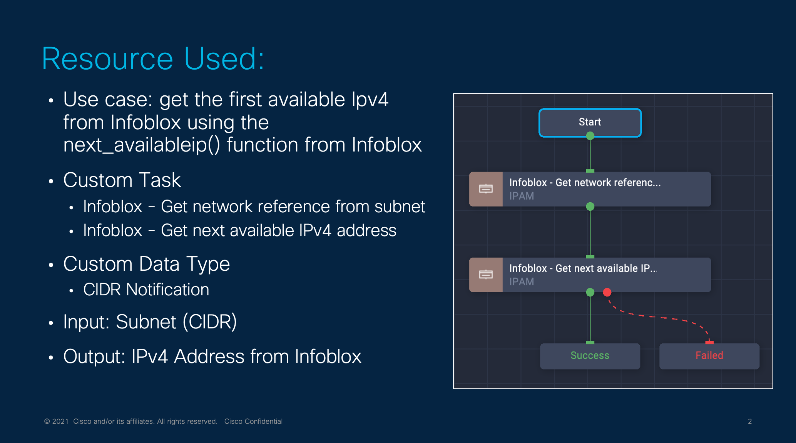
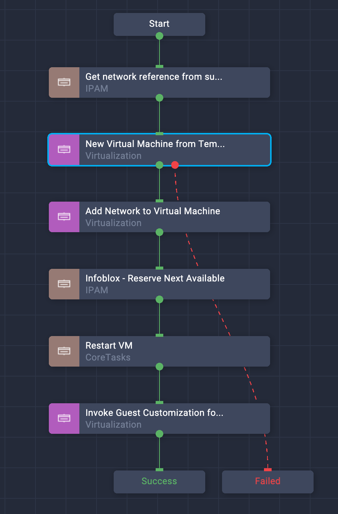

# Repo for the ICO February Contest

As of today, IPAM is a fundamental step in the provisioning process. However, maintaining a list of several IP addresses is cumbersome. We all need to have an IP (for VM, storage, servers, etc.), and for that reason, the industry comes out with an IPAM solution. 

Intersight doesn't provide any integration with external IPAM solutions such as Infoblox: for that reason, new custom tasks (as well workflows) are designed to support Infoblox IPAM solutions in ICO.
Intersight doesn't integrate external IPAM solutions such as Infoblox (the most used one). For that reason, new custom tasks (and workflows) are now available through this repo to enable  Infoblox IPAM solutions in ICO.

Current use cases are highlighted below. These use cases can be implemented as ICO Workflow and rely on custom task.
 - Create a VM and assign dynamically an IP released by IPAM
 - Provision a new server with a specific IP from IPAM
 - Anything that requires an IP

The above workflow rely on the below custom task:
 - Infoblox - Get network reference from subnet
 - Infoblox - Get next available IPv4 address
 - Infoblox - Reserve Next Available IPv4 address
 - Infoblox - Delete IPv4 Reservation
 - Infoblox - Infoblox - Reserve IPv4 Address

## Technical Information

Infoblox expose a REST API, named WAPI: all API calls to Infoblox are encrypted using SSL/TLS and authenticated using HTTP basic authentication. Every WAPI Object is referenced by a unique Object Reference. WAPI returns this reference when an object is created, modified, deleted or read. This reference is used to identify the object for the same operations.

> **Note:** All the task created in ICO in this repository rely on the Infoblox unique Object Reference: in the current implementation, the WAPI Object is name xxxObjectReference, (e.g. networkObjectReference, ipv4ObjectReference and so on).

Note this is a work in progress repository, and as of today, only IPv4 is supported. Soon Ipv6 support will be releases as well.

## Custom resources created in Intersight

The following entity will be created in Intersight after importing the workflow/task:
 - Custom Data Type: 
   - IPv4 CIDR Notation
   - MAC Address in IETF/IEEE format
 - Custom Task: 
   - Infoblox - Get network reference from subnet
   - Infoblox - Get next available IPv4 address
   - Infoblox - Reserve Next Available IPv4 address
   - Infoblox - Delete IPv4 Reservation
 - Custom Workflow:
   - Demo Deploy VM - Advanced Mode
 - Custom Category: 
   - IPAM

**Remember, it is your responsibility to claim Infoblox system as new HTTP Endpoint target in Intersight**. Don't know how to do that: check the Intersight manual [here].(https://intersight.com/help/saas/getting_started/claim_targets)

## Custom Task Technical Details

Find below additional information on the custom task available in this repository.,

### Infoblox - Get next available IPv4 address
Get the next available IPv4 address in the given network, by using the internal Infoblox function next_available_ip().

### Infoblox - Reserve Next Available IPv4 address
Reserve the next available IPv4 in a network.

> **Note: This custom task support Rollbacks by using Infoblox - Delete IPv4 Reservation**

### Infoblox - Delete IPv4 Reservation
Delete an IPv4 Reservation

### Infoblox - Infoblox - Reserve IPv4 Address
Reserve a custom IPv4 Address

## Basic Workflow: Get the first available IPv4 from Infoblox from a fiven network.
The below workflow simple combine the two task created before to get the IPv4 from Infoblox.

Youtube video link: https://youtu.be/9G92L1j_4Sc

## Sample Workflow: Create a VM and assign dynamically an IP released by IPAM

The below workflow simply deploy a new VM, attach a new network, and assign dynamically an IP released by  IPAM. The workflow has been built relying on the above custom task. The workflow make use of one custom task:
 - Reserve Next Available IPv4 address

The workflow requires the following input:
 - VM Name: the name to assign to the newly created VM
 - The network where to get the IP in CIDR notation (e.g. 192.168.200.0/24)
 - Hostname: the hostname assigned to ther VM

